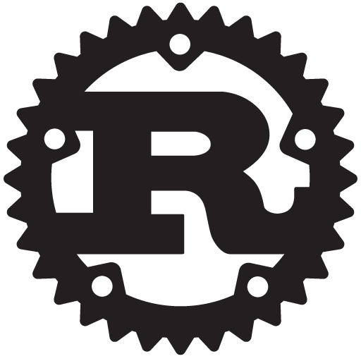

#[fit] In Rust We Trust

## Alex Burkhart - @saterus

^
- consultant at Mutually Human in Columbus, OH
- Rich Web Applications, Rails, Ember
- we all wear a lot of hats
- which is great, because i love learning stuff

---



^
- i started learning rust last year
- probably obvious, i'm really digging it

---

# [fit] Rust =
# [*Haskell*, *C++*, *Python*].max()


^
- rust is the best of these
- many very smart people, with a wide variety of backgrounds
- wide variety of influences
- quite lot of new language concepts
- smaller than c++
- much bigger than javascript
- highlights today

---

> "The goal is to design and implement a safe, concurrent, practical, static systems language."
-- Rust Project FAQ

^
- use recent computer science research.
- not to a Haskell-level though.
- ruby's GC was invented in the 60's.
- we can at least learn from some of our mistakes as an industry
- bring joy to non-Haskellers/Lispers

---

# Aim to Gradually Replace C++

^
- practically let's us not accomplish this overnight
- C++ still has a lot going for it
- safety and concurrency aren't its strengths though
- win small battles, integrate slowly

---

> "Rust keeps the C abstract machine model but innovates on the language interface."
-- Raphael Poss, *Rust for Functional Programmers*

^
- c was designed as portable assembly language
- major concepts in c map directly to hardware concepts
- rust keeps that strength
- wonderful, since this stuff is super well documented
- but rust is a nicer language for a programmer to work with

---

## No Runtime

^
- no memory overhead
- easy ffi with other languages

---

## No Garbage Collector

^
- no runtime
- no pauses
- predictable perf

---

# Zero Cost Abstractions

^
- idea from design of c++
- compile time, not runtime
- memory management
- polymorphism
- iterators
- enums/structs

---

# Better Programmer Interface

^
- we steal the zero cost abstraction idea from c++
- but c++ was always a superset of c
- we don't have that restriction

---

# Immutability by Default

```rust
fn main() {
  let x = 0;
  x = 1; // => error:
         // re-assignment of immutable variable `x`

  let mut y = -10;
  y = 20; // => ok!
}
```

^
- immutability is a good thing
- make it easy as possible

---

# Type Inference

```rust
fn double(n: u32) -> u32 {
  n * n
}

fn main() {
  let x = 500;
  let y = double(250);
  let z = x + y;
}
```

^
- annotate our functions with explicit types
- never forced to type them anywhere else

---

# Enums

```rust
enum Coffee {
  Hot(u8),    // temp F
  Iced(bool), // still has ice
  Instant,
}

fn main() {
  let first_cup: Coffee = Coffee::Iced(true);
  let second_cup: Coffee = Coffee::Hot(212);

  println!("Drink {:?} then {:?}.", first_cup, second_cup);
}
```

^
- union types / algebraic data types
- variants of the same type
- in addition to c style structs

---

# Destructuring

```rust
fn drinkable(cup: Coffee) -> bool {
  match cup {
    Coffee::Hot(120...150) => true,
    Coffee::Iced(x) => x,
    _ => false,
  }
}
```

^
- match statement
- match on shape / form
- several other ways to destructure as well
- very powerful

---

# Traits

```rust
impl Eq for String { /* details omitted */ }
impl Hash for String { /* details omitted */ }

impl<K, V> MyHashMap<K,V> where K: Eq + Hash {
  // details omitted
}

fn main() {
  let map: MyHashMap<String, u32> = MyHashMap::new();
  // compiles!
}

// note: not quite the std lib implementations...
```

^
- haskell's type classes
- bounds on our polymorphic types
- constraints on your type to rely on

---

# Iterators & Closures

```rust
fn main() {

  let squares = (0..10).map(|n| n * n);

  for i in squares {
    println!("{:?}", i);
  }

}
```

^
- powerful iterator library
- utilizes closures for ruby-like apis
- safe access, without runtime checks
- faster than indexing!

---

# Hygenic Macros

```rust
fn main() {
  let v1 = vec![1,2,3];

  // vec![] expands into:

  let mut v2 = Vec::with_capacity(3);
  v2.push(1);
  v2.push(2);
  v2.push(3);
}
```

^
- macros let you write code that writes code
- very powerful
- hygine guarantees no name collisions

---

# Testing

```rust
fn double(n: u32) -> u32 {
  n * n
}

#[test]
fn double_zero_is_zero() {
  assert_eq!(0, double(0));
}
```

^
- built in test-unit style testing
- popular generative testing library / quickcheck

---

# Module System

```rust
// in project_a/src/traffic/color.rs
mod traffic {
  pub enum Color { Red, Yellow, Green };
}

// in project_b/src/main.rs
extern crate project_a;
use traffic::Color;

fn main() {
  let stoplight = Color::Red;
  println!("Imported a {:?} stoplight!", stoplight);
}
```

^
- no global namespace problem
- explicit, scoped imports
- no header files

---

# Package Management

^
- first language ever to ship 1.0
- cargo
- build tool
- dependency tool

---

# What is in Rust?

^
- we very briefly discussed some cool rust features
- that's a nice collection of features

---

# What is *Not* in Rust?

^
- but more importantly
- what isn't in rust

---

## Null

^
- option types

---

## Implicit Type Conversion

^
- value explicitness

---

# Exceptions

^
- no unwinding
- error types

---

## Inheritance

^
- runtime overhead

---

## Function Overloading

^
- confusing, error prone
- traits are more general, more powerful

---

# Laziness

^
- at least by default
- reasoning is easier
- composition is a little harder
- iterators are lazy

---

# Higher Kinded Types

^
- wanted
- forward-compatible feature
- on the post-1.0 priority list
- nicer generic collections

---

# Purity

^
- aiming for mem safety
- not complete referential transparency
- in practice, this is a pretty nice balance

---

# Garbage Collector

^
- would require a runtime
- runtime penalty
- more difficult ffi

---

# *Manual* Memory Management

^
- you still think about it
- but you can't really shoot yourself in the foot

---

# *Manual* Memory Management

- Null Pointers
- Double Frees
- Never Frees
- Pointer Arithmetic
- Dangling Pointers

^
- we remove all the footguns

---

## Shared Mutable State

^
- all of these things either were not necessary
- or would hurt the goals of the project
- rust takes special care of memory
- this helps us achieve our safety goals

---

# Memory Unsafety

- Accessing Uninitialized Data
- Writing Invalid Data
- Breaking Aliasing Rules
- Data Races
- Calling Foreign Functions

^
- definition
- in "safe" rust code, you cannot run into these problems
- not recursive, build safe foundations
- "human checked"

---

# Human Still Required

- Rc Cycles -> Leaks
- Deadlocks
- I/O
- Int Overflow

^
- not considered unsafe
- probably don't want leaks or deadlocks
- not compiler checked

---

# Memory Management Stategies

^
- let's review the normal options
- give us context for what rust does

---

# Manual Memory Management

^
- c / c++ / d
- explicit control over every resource
- very performant
- no help
- the best mistake is a memory leak
- lot's of undefined behavior
- segfaults
- you must not make any mistakes

---

# Garbage Collection

^
- lisp / java / c# / ruby / python
- no real control
- allocate everything on the heap
- runtime cost
- doesn't save you from leaks
- saves you from most UB and segfaults


---

# Automatic Reference Counting

^
- sweet new tech from apple
- obj-c & swift
- this is just an amoratized GC strategy
- can still make cycles of strong refs that leak

---

# Ownership

^
- rust's strategy
- aligns with all our goals
- retain control & predictability for memory
- no runtime cost
- eliminates leaks, UB, segfaults
- handles allocation, initialization, and cleanup: raii
- writes the memory management code that a perfect c++ programmer would
- violations are compile time errors!
- single most important idea in rust

---

# Ownership Rules Summary

1. Single Owner
1. Mutability Requires Exclusivity
1. Sharing Requires Immutability

^
- prevents entire classes of errors
- both single threaded and concurrent
- provable at compile time
- dive into these

---

# Single Responsible Owner

```rust
fn main() {
  // allocate some memory
  let stoplight = Color::Red;

  // access value of stoplight
  println!("the value of stoplight: {:?}", stoplight);

  // owner `stoplight` falls out of scope
  // owner drops its property
}
```

^
- as a Name falls out of scope, it recursively drops anything it owns
- drop -> destructor/free
- safe memory management

---

# Ownership is a Tree

```rust
fn main() {
  let mut drink_caddie = Vec::new();
  for _ in 0..4 {
    drink_caddie.push(Coffee::Hot(212));
  }

  println!("all the coffee: {:?}", drink_caddie);

  // owner `coffee` falls out of scope
  // owner drops its property
  // drop the Vec --> drop each Coffee --> drop the u8
}
```

^
- enums/structs own their contents
- vecs are pointers heap allocated dynamically sized arrays
- vec owns the enum owns the u8
- own their contents => responsible for cleanup
- solves initialization & cleanup

---

# Mutability

```rust
fn main() {
  let mut coffee = Box::new(Coffee::Hot(85));

  *coffee = Coffee::Hot(212);

  println!("the value of coffee: {:?}", coffee);
}
```

^
- owner is free to allow mutation
- box is a heap allocated owned pointer
- rust has great automatic dereferencing
- it has exclusive access to its resources
- no harm, no foul

---

# Ownership Transfer

```rust
fn main() {
  let coffee_shop = Box::new(Coffee::Hot(85));

  let customer = coffee_shop;

  println!("the value of customer: {:?}", customer);

  println!("the value of coffee_shop: {:?}", coffee_shop);
  // => error! use of moved value `coffee_shop`!
}
```

^
- owner can change
- responsibility transfers too
- accessing old owner is compile time error
- prevents aliasing, since old owner is inaccessible

---

# Borrowing

```rust
fn main() {
  let showing = BluRay::Disc;

  let friend_a = &showing;
  let friend_b = &showing;

  println!("hooray! everyone can share! {:?}", showing);
  println!("hooray! everyone can share! {:?}", friend_a);
  println!("hooray! everyone can share! {:?}", friend_b);
}
```

^
- very useful
- ampersand is the borrow operator, not address-of
- works similarly though, creates a reference
- verified to be valid for the lifetime of the owner
- many shared references

---

# Aliasing & Mutability: Pick One

```rust
fn main() {
  let mut coffee = Box::new(Coffee::Hot(85));

  reheat(&mut coffee);

  println!("coffee temp: {:?}", coffee);
  // => coffee temp: 180
}
```

^
- mutable borrows
- requires exclusivity
- owner unaccessible for the life of the borrow
- exclusivity without ownership transfer

---

# Concurrency Building Blocks

^
- threads follow ownership too
- threads own their resources
- ownership guarantees safe concurrency
- compile time!
- something i haven't seen haskell do
- library based

---

# Data Race

1. 2+ threads accessing the same data
1. at least 1 is unsynchronized
1. at least 1 is writing

^
- through ownership, we know we are either sharing or exclusive
- both great models for concurrency
- classic: synchronization
- purely functional: forbid mutation
- actors: forbid aliasing
- flexibility: multi-paradigm

---

# Concurrency without Aliasing

```rust
fn main() {
  let (tx, rx) = channel();

  for task_num in 0..8 {
    let tx = tx.clone();
    Thread::spawn(move || {
      let msg = format!("Task {:?} done!", task_num);
      tx.send(msg).unwrap();
    }).detach();
  }

  for data in rx.iter() {
    println!("{:?}", data);
  }
}
```

^
- threads are meta-owners of their memory
- ie. ownership is moved
- many tx, one rx
- no aliasing
- safe access through the channel

---

# Shared Immutable Memory

```rust
fn main() {
  let (tx, rx) = channel();
  let huge_struct = Arc::new(HugeStruct::new());

  for task_num in 0..8 {
    let tx = tx.clone();
    let huge_struct = huge_struct.clone();
    Thread::spawn(move || {
      let msg = format!("Task {:?}: Accessed {:?}", task_num, huge_struct.huge_name);
      tx.send(msg).unwrap();
    }).detach();


  for data in rx.iter() {
    println!("{:?}", data); // 10x => Task N: Accessed I'M HUGE
  }
}
```

^
- atomic read/write access
- cloning Arcs is cheap
- increment internal counter

---

# Shared Mutable Memory

```rust
Mutex
```

---

# When to Use Rust?

^
- most common question i get after telling people about rust
- i don't write c++ now
- when would i use rust?

---

## CPU Bound

^
- we're just waiting around on our work to finish
- my phone has 4 cores though
- so let's use those other cores
- utilize concurrency with rust
- doesn't have to be scary

---

## I/O Bound

^
- waiting on something else to finish
- disk? network? external job?
- utilize concurrency again
- i/o applications are highly concurrent

---

## Low Latency

^
- not just fast
- predicable performance
- not blocked
- 60fps is 16.6ms consistently
- hard to guarentee with a garbage collector
- large game development community

---

## Memory Constrained

^
- memory is cheap...if you work on servers
- embedded software
- mobile devices
- inside other processes
- rust has low memory overhead

---

## Interoperative

^
- we don't plan to rewrite the world
- c is latin of computer systems
- rust has great c interop
- slot in where it is the best tool: polyglot env
- os libraries
- os dev

---

## Requires Portability

^
- contributed greatly to vm-based languages
- we use llvm
- cross compile
- build most architectures
- use rust to build native multiplatform applications

---

## High Security

^
- we write all our most critical security infrastructure in C
- how crazy does that sound?
- heartbleed is a buffer over-read
- computers can solve this for us
- no rust crypto libraries *yet*
- make your applications more secure

---

## High Reliability

^
- we talk a lot about safety
- usually compile time
- these make writing code faster
- also more reliable
- fewer runtime surprises!
- great fit for anywhere that has a high cost on bugs
- or high cost for redeployment

---

## Great Software

^
- general purpose programming language
- modern features & tooling
- highly expressive
- focus on solving your problem

---

#[fit] Big News:
#[fit] 1.0


^
- 1.0 released last friday!
- 5 year effort funded by mozilla
- 40k commits

---

# Rust 1.0


^
- language & std lib stability
- semantic versioning guarantees
- 1.0 -> 1.1 -> 1.2
- this is the beginning
- HKT, GADTs
- start building better software today

---

#[fit] Rust at LambdaConf

### An Introduction to Rust: Or, "Who Got Types in My Systems Programming!"
### Jared Roesch
### 11am-1pm Sunday

---

#[fit] Columbus Rust Society
## @columbus*rust*

^
- if this peaked your interest
- come learn more
- columbus rust society next wednesday at the forge

---

#[fit] Mutually Human
## mutually*human*.com

^
- software consultants
- Columbus & Grand Rapids
- hire us!
- we're hiring!

---

# Thanks!

### Alex Burkhart
### *@saterus*
### **Mutually Human**


